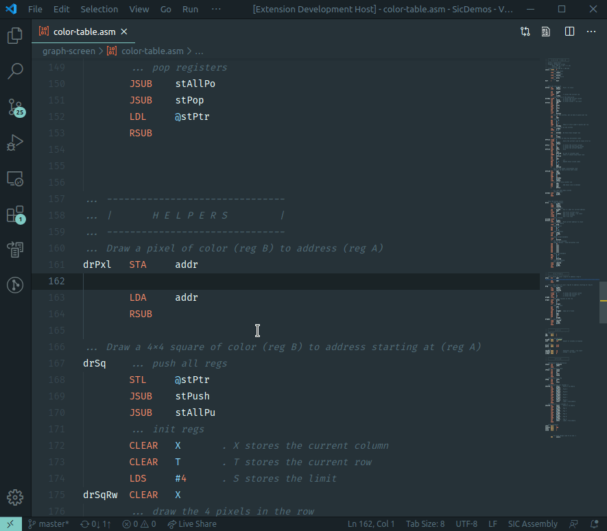

# SIC Assembly

This extension adds the support for the [SIC (Simplified Instructional Computer)](https://en.wikipedia.org/wiki/Simplified_Instructional_Computer) assembly.

## Features

- Syntax highlighting
- Code completion
- Go to definition
- Find all references
- Document symbol definitions
- Hover (mnemonics and symbols)
- Code formatting
- Setting the default language indentation to 8 character long tabs
- Snippets

### Code formatting
The Format Document action automatically aligns the columns in your SIC code, so there's enough space for labels, mnemonics and operands.

## Screenshots
- Feature demo

    

- Syntax highlighting on the [Material Theme]([https://link](https://marketplace.visualstudio.com/items?itemName=Equinusocio.vsc-material-theme)).

    

## Known Issues

- Please report any issues or suggestions you find on [GitHub](https://github.com/jakoberzar/vscode-sic-assembly/issues).