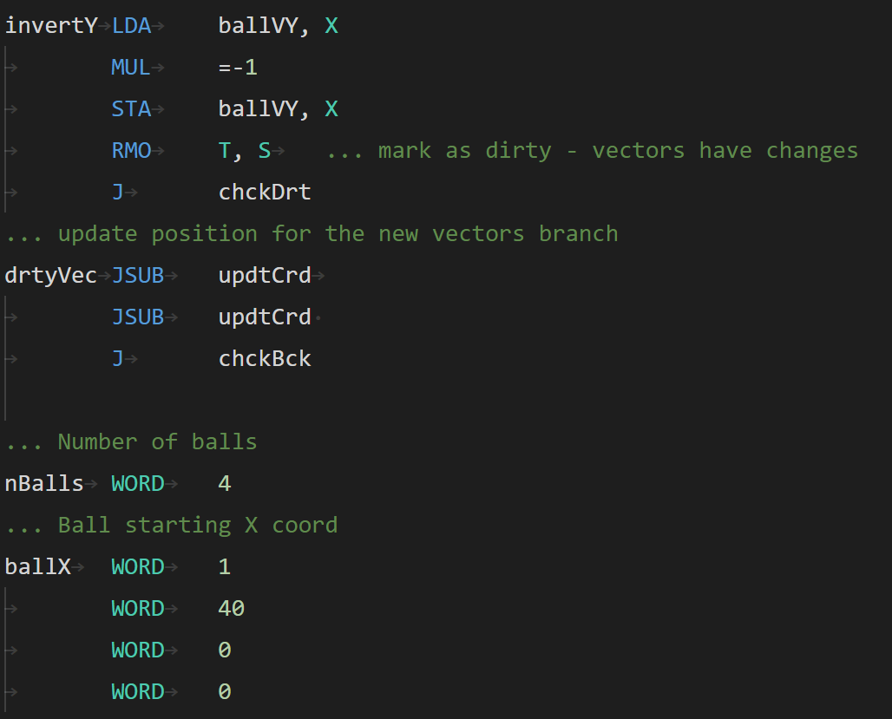

# SIC Assembly

This extension adds the support for the [SIC (Simplified Instructional Computer)](https://en.wikipedia.org/wiki/Simplified_Instructional_Computer) assembly.

## Features

- Syntax highlighting
- Snippets
- Setting the default language indentation to 8 character long tabs

## Screenshots
Syntax highlighting on Dark+ theme.

## Known Issues

- Please report any issues or suggestions you find on [GitHub](https://github.com/jakoberzar/vscode-sic-assembly/issues).